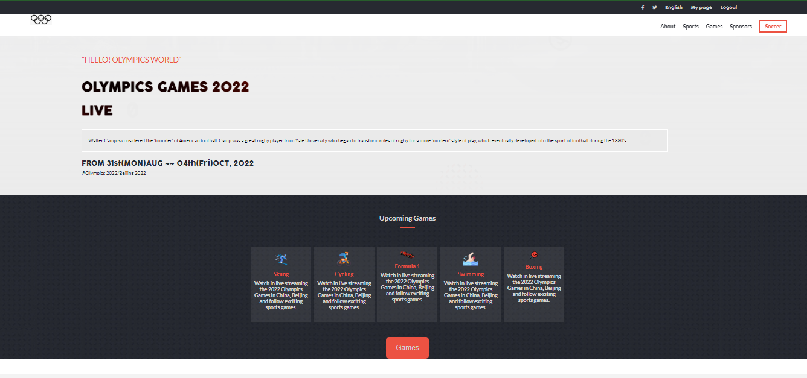
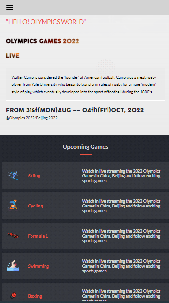

# OLYMPICS GAMES 2022

## Description

OLYMPICS 2022 website is a major international multi-sport event held once every four years. The mordern Olympics were inspired by the ancient Olympics games held in Greece. I developed this website to show the wonderful games being payed during this period of Olympics.

- This is the page view:

    Desktop version: 

    
    
    Mobile Version:

    

> Learning Objectives

- Use semantic HTML tags.
- Apply best practices in HTML code.
- Use CSS box model.
- Use CSS selectors correctly.
- Use Flexbox to place elements in the page.
- Demonstrate ability to create UIs adaptable to different screen - sizes using media queries.
- Use GitHub Pages to deploy web pages.
- Apply JavaScript best practices and language style guides in code.
- Use JavaScript to manipulate DOM elements.
- Use JavaScript events.
- Use objects to store and access data.
- Communicate technical concepts to other technical people.
- Build the capstone project website.

## Built With

- HTML
- CSS3 (Flexbox and Grid)
- JavaScript
- Git and GitHub
- Visual Studio Code

## Live Demo

[Live Demo Link](https://braincee.github.io/Sports-News/)

## Zoom Video

[Link Zoom](https://www.loom.com/share/25ae4e2b6bbb45a38378e0bb06ba0313)

## Getting Started

To get a local copy for this project and running follow these simple example steps.

### Prerequisites

- You need to have git installed in your computer
- A text editor or terminal (Visual Studio Code or Atom)
- A web brower to view output (Google Chrome)

### Setup

- To clone the repository run this command `git clone https://github.com/braincee/Sports-News.git`

### Run tests

For tracking linters errors locally you need to follow these steps:

- After cloning the project you need to run this command

  > npm install
  > `This command will download all the dependencies of the project`

- For tracking the linter errors in HTML file run:

  > npx hint .

- For tracking the linter errors in CSS file run:

  > npx stylelint "\*_/_.{css,scss}"

- And For tracking the linter errors in JavaScript file run:

  > npx eslint .

### Deployment

- I used GitHub Pages to deploy my website
- For more information about publishing sources, see "[About github page](https://docs.github.com/en/pages/getting-started-with-github-pages/about-github-pages#publishing-sources-for-github-pages-sites)"

## Author

👤 **Stephen Annor**

- GitHub: [@braincee](https://github.com/braincee)
- Twitter: [@annor0543](https://twitter.com/annor0543)
- LinkedIn: [Stephen Annor](https://www.linkedin.com/in/kwesi-appiah-1387801a1/)

## 🤝 Contributing

Contributions, issues, and feature requests are welcome!

Feel free to check the [issues page](../../issues/).

## Show your support

Give a ⭐️ if you like this project!

## Acknowledgments

- Design and inspiration by [Cindy Shin on Behance](https://www.behance.net/gallery/29845175/CC-Global-Summit-2015).

- Hat tip to [Microvers](www.microverse.org) and all the staff
- Thanks to My coding Partners
- Thanks to My Morning-session-group and Standup-team Partners and
- Thanks to Code Reviewers

## 📝 License

This project is [MIT](./MIT.md) licensed.
